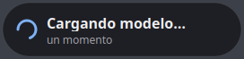

# 🎙️ Dictado por Voz

**Dictado por voz offline, en español, para Linux.** Habla y el texto aparece en
cualquier aplicación. Privado, gratuito y sin conexión: tu voz nunca sale de tu
ordenador.

<p align="center">
  <br>
  <em>Burbuja flotante que te avisa en todo momento de que se está grabando.</em>
</p>

---

## ✨ Características

- 🎙️ **Dicta en cualquier campo de texto** — escribe según hablas, en la ventana que tengas activa.
- 🔒 **100% offline y privado** — todo el reconocimiento ocurre en tu equipo (motor [Vosk](https://alphacephei.com/vosk/)). No se envía audio a ningún servidor.
- 🟢 **Interfaz flotante clara** — una burbuja siempre visible te indica cuándo está *cargando* y cuándo está *grabando*, con botón para parar. No roba el foco del teclado.
- ✍️ **Puntuación por voz y mayúsculas automáticas** — di *"punto"*, *"coma"*, *"nueva línea"*… y las convierte en signos.
- 🇪🇸 **Pensado para español** — usa el modelo grande de Vosk; ampliable a otros idiomas.
- ⚡ **Ligero y gratuito.**

<p align="center">
  <br>
  <em>Aviso mientras el modelo se carga en memoria (para que sepas cuándo hablar).</em>
</p>

---

## 📦 Requisitos

- Linux con **X11** (probado en KDE Plasma / Ubuntu 24.04).
- `python3` con **PyQt5** (interfaz).
- Un entorno virtual con **vosk** (motor de reconocimiento).
- [`nerd-dictation`](https://github.com/ideasman42/nerd-dictation) (captura y escritura de texto).
- `xdotool` (inyección de texto en X11) y `parec`/PipeWire-pulse (audio).
- El **modelo español grande de Vosk** (`vosk-model-es-0.42`, ~1.4 GB) — se descarga aparte.

---

## 🚀 Instalación

```bash
# 1) Dependencias del sistema (Debian/Ubuntu)
sudo apt install python3-pyqt5 xdotool pipewire-pulse

# 2) Motor nerd-dictation
git clone https://github.com/ideasman42/nerd-dictation ~/nerd-dictation

# 3) Entorno virtual con Vosk
python3 -m venv ~/dictado-venv
~/dictado-venv/bin/pip install vosk

# 4) Modelo español grande de Vosk (~1.4 GB)
mkdir -p ~/vosk-models && cd ~/vosk-models
curl -LO https://alphacephei.com/vosk/models/vosk-model-es-0.42.zip
unzip vosk-model-es-0.42.zip && rm vosk-model-es-0.42.zip

# 5) Este proyecto
git clone https://github.com/TheWolf1724/Dictado_Voz ~/Dictado_Voz
cp ~/Dictado_Voz/dictado.sh        ~/dictado.sh && chmod +x ~/dictado.sh
cp ~/Dictado_Voz/dictado-gui.py    ~/dictado-gui.py
mkdir -p ~/.config/nerd-dictation
cp ~/Dictado_Voz/config/nerd-dictation.py ~/.config/nerd-dictation/nerd-dictation.py
```

### Atajo de teclado (KDE)

Asocia `~/dictado.sh` a un atajo global (p. ej. **Ctrl+Shift+H**) desde
*Preferencias del Sistema → Atajos → Atajos personalizados*. Pulsar el atajo
inicia el dictado; pulsarlo otra vez lo detiene.

---

## 🎧 Uso

1. Haz clic en el campo de texto donde quieras escribir.
2. Pulsa el atajo → aparece la burbuja **"Cargando modelo…"**.
3. Cuando cambie a **"Grabando"** (punto rojo), habla con normalidad.
4. Pulsa el botón **■** de la burbuja o el atajo de nuevo para parar y volcar el texto.

> 💡 El modelo grande tarda ~2-4 s en cargar la primera vez. La burbuja te avisa
> con un spinner para que no empieces a hablar antes de tiempo.

### 🗣️ Comandos de puntuación por voz

| Dices… | Escribe |
|---|---|
| punto | `.` |
| coma | `,` |
| punto y coma | `;` |
| dos puntos | `:` |
| punto y aparte | `.` + salto de línea |
| puntos suspensivos | `…` |
| nueva línea / salto de línea | salto de línea |
| nuevo párrafo | línea en blanco |
| abre/cierra interrogación | `¿` … `?` |
| abre/cierra exclamación | `¡` … `!` |
| abre/cierra paréntesis | `(` … `)` |
| abre/cierra comillas | `"` |
| guion | `-` |

Además pone **mayúscula automática** al inicio y tras cada `.`, `?`, `!` o salto de línea.

---

## 🧩 Cómo funciona

- **`dictado-gui.py`** — interfaz PyQt5 (burbuja flotante). Lanza `nerd-dictation`,
  detecta cuándo el modelo terminó de cargar (aparece el proceso `parec`) para pasar
  de *cargando* a *grabando*, y al parar llama a `nerd-dictation end` para volcar el texto.
- **`dictado.sh`** — script *toggle* que arranca/detiene la interfaz y ajusta la
  ganancia del micrófono para que no sature.
- **`config/nerd-dictation.py`** — post-procesa el texto reconocido: puntuación por
  voz y mayúsculas automáticas.

---

## 🪟 ¿Y Windows?

El **motor (Vosk) y la interfaz son portables**; la parte que ata a Linux es
`nerd-dictation` (usa `xdotool`). Una versión multiplataforma pasaría por leer el
audio directamente con `sounddevice`, escribir el texto con `pyautogui`/portapapeles
y cambiar PyQt5 por PySide6. *(En el horizonte.)*

---

## 📄 Licencia

Publicado bajo **GNU GPL v3** (ver [`LICENSE`](LICENSE)). Es copyleft: cualquier
obra derivada debe distribuirse también bajo GPLv3. Esta licencia viene condicionada
por las dependencias ([nerd-dictation](https://github.com/ideasman42/nerd-dictation)
y [PyQt5](https://www.riverbankcomputing.com/software/pyqt/), ambas GPL).

## 🙏 Créditos

- [Vosk](https://alphacephei.com/vosk/) — motor de reconocimiento de voz offline (Apache-2.0).
- [nerd-dictation](https://github.com/ideasman42/nerd-dictation) — captura y escritura de texto (GPL).
